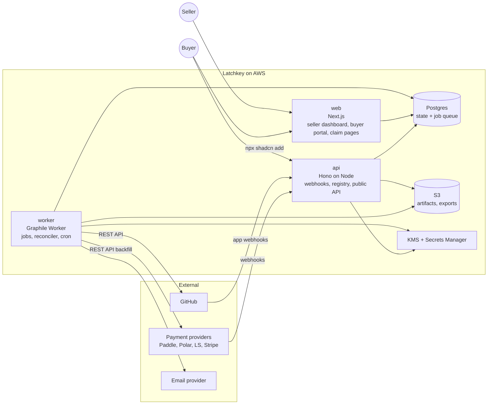

# Latchkey: Architecture

> Read `product.md` first for the why. This document is the how.
> If code and this document disagree, do not silently fix either one. Add a decision entry in `milestones-and-logs.md` first, then update whichever side is wrong.
>
> **Verification note:** third-party API details below (GitHub endpoints, provider webhook event names, limits) were correct to the best of planning knowledge in September 2026. Before implementing any adapter or GitHub call, the agent MUST confirm against the provider's current official docs and record any difference as a decision entry.

---

## 1. Goals and hard constraints

**Goals**
1. Access is correct: buyers who should have access get it, buyers who should not lose it.
2. Access is reliable: no lost events, no stuck invites, recovery from any outage by replaying and reconciling.
3. Portable: sellers can switch payment providers without disturbing buyers.
4. Safe: least privilege on GitHub, secrets encrypted, strict tenant isolation.

**Hard constraints**
- We never process money, store card data, or act as merchant of record.
- We never remove a GitHub org member or collaborator that we did not add.
- Every external input is hostile until verified.
- Every side effect is idempotent and safe to retry.

---

## 2. System overview



**The core idea in one paragraph:** providers and GitHub send us events. We store each verified event exactly once. From the stored events we compute what *should* be true (licenses and grants: the desired state). A reconciler compares desired state with what GitHub *actually* shows (observed state) and performs the smallest idempotent action to close the gap. Because everything flows through "store event, recompute desired state, reconcile", duplicate events, out-of-order events, outages, and manual changes are all handled by the same machinery.

---

## 3. Tech stack

| Concern | Choice | Why |
|---|---|---|
| Language | TypeScript (strict) everywhere | One language across web, api, worker, shared domain |
| Monorepo | pnpm workspaces + Turborepo | Shared packages, cached builds |
| Web | Next.js (App Router) | Dashboard, buyer portal, claim pages |
| API | Hono on Node | Small, fast, explicit; webhook and registry endpoints |
| Database | PostgreSQL 16 | Relational integrity, transactions, row locks |
| ORM / migrations | Drizzle ORM + drizzle-kit, with hand-written down migrations | Typed queries, SQL-first migrations |
| Jobs | Graphile Worker | Postgres-backed, jobs can be added inside the same DB transaction, built-in cron |
| Validation | Zod | Parse every external payload and request body |
| Auth | GitHub App user authorization, server-side sessions in Postgres | Sellers and buyers are developers |
| Email | Resend behind an `EmailSender` interface | Fast to ship; swappable for SES |
| Storage | S3 (versioned, private) | Registry artifacts, exports |
| Secrets | AWS Secrets Manager + KMS envelope encryption | Encrypt provider keys and webhook secrets per seller |
| Hosting | AWS ECS Fargate (web, api, worker) behind ALB, RDS Postgres | Owner is AWS-experienced |
| IaC | AWS CDK (TypeScript) | Same language |
| Errors | Sentry | Exceptions with context |
| Logs / metrics | Structured JSON logs (pino) to CloudWatch, custom metrics | Searchable, alarmable |
| Tests | Vitest, Testcontainers (Postgres), Playwright | See `CLAUDE.md` testing rules |
| Our own billing | Paddle | Works for a Pakistan-based business (D-013) |

Changing any row requires a decision entry.

---

## 4. Repository layout

```
/
├── CLAUDE.md                 agent entry point
├── AGENTS.md                 pointer to CLAUDE.md
├── docs/
│   ├── product.md
│   ├── architecture.md
│   ├── implementation-plan.md
│   └── milestones-and-logs.md
├── apps/
│   ├── web/                  Next.js
│   ├── api/                  Hono
│   └── worker/               Graphile Worker tasks + cron
├── packages/
│   ├── core/                 PURE domain logic: license fold, desired grants, policies. No I/O.
│   ├── db/                   Drizzle schema, migrations (up + down), repositories
│   ├── github/               GitHub App client, rate limit handling, typed errors
│   ├── providers/            payment provider adapters + normalized event types
│   ├── delivery/             registry builder, artifact storage, fingerprinting
│   ├── crypto/               envelope encryption, token hashing
│   ├── email/                EmailSender interface + templates
│   ├── config/               env parsing with Zod, fails fast on boot
│   └── testing/              fakes (FakeGitHub, FakeClock, provider fixtures), factories
├── infra/                    CDK app
└── fixtures/
    └── webhooks/<provider>/  real sandbox payloads with signatures, captured not hand-written
```

**Dependency rule:** `core` depends on nothing. `apps/*` depend on packages. Packages never import from `apps`. Lint enforces this.

---

## 5. Domain model

All seller-owned tables carry `seller_id`. IDs are UUIDv7. Timestamps are `timestamptz` in UTC.

### 5.1 Tables

| Table | Purpose | Key columns / constraints |
|---|---|---|
| `sellers` | A selling account | `id`, `slug` unique, `plan`, `status` |
| `users` | People who log in (seller members and buyers share this) | `id`, `github_user_id` unique (bigint), `github_login` (cache only), `email` |
| `seller_members` | Who can manage a seller | `seller_id`, `user_id`, `role` (owner, admin, viewer) |
| `sessions` | Server-side sessions | `id` (hashed token), `user_id`, `expires_at` |
| `github_installations` | GitHub App installed on an org | `installation_id` unique, `seller_id`, `account_login`, `account_type`, `suspended_at`, `uninstalled_at` |
| `provider_connections` | A connected payment provider | `seller_id`, `provider`, `webhook_secret_enc`, `api_key_enc`, `key_version`, `status`, `mode` (test, live) |
| `products` | What is sold | `seller_id`, `name`, `status` (draft, active, archived), `update_window_days` nullable, `revoke_policy` jsonb |
| `deliverables` | How a product is delivered | `product_id`, `type` (github_team, registry, download), `config` jsonb (for github_team: `installation_id`, `team_id`, `team_slug`) |
| `provider_products` | Maps provider product/price IDs to our product | `provider_connection_id`, `external_product_id`, `external_price_id`, `product_id`, `seats` default 1, unique on (connection, external ids) |
| `licenses` | One purchase or subscription | `seller_id`, `product_id`, `status`, `kind` (one_time, subscription), `seats_total`, `purchased_at`, `updates_until` nullable, `purchase_email`, `manager_user_id` nullable, `status_reason` |
| `license_external_refs` | Links a license to provider objects (many providers over time) | `license_id`, `provider`, `external_order_id`, `external_subscription_id`, `external_customer_id`, unique on (provider, external_order_id) |
| `seats` | Person slots inside a license | `license_id`, `user_id` nullable, `assigned_at`, `released_at` |
| `claims` | Claim links | `license_id`, `token_hash` unique, `expires_at`, `used_count`, `max_uses` |
| `grants` | Desired access for one seat on one deliverable | `seat_id`, `deliverable_id`, `desired` (present, absent), `observed` (see 6.2), `provenance` (added_by_us, pre_existing), `last_reconciled_at`, `attempts`, `next_attempt_at`, `github_invitation_id` nullable, `invite_sent_at`, `invite_count` |
| `external_events` | Every verified inbound event, stored once | `source` (provider name or github), `external_event_id`, `seller_id` nullable, `received_at`, `occurred_at`, `type`, `payload` jsonb, `processed_at`, `process_error`; unique on (source, external_event_id) |
| `license_events` | Normalized events applied to a license (the fold input) | `license_id`, `external_event_id`, `type`, `occurred_at`, `data` jsonb |
| `activity_log` | Human-readable history for sellers | `seller_id`, `subject_type`, `subject_id`, `action`, `reason`, `actor` (system, user id, provider), `created_at` |
| `drift_items` | Differences needing seller attention | `seller_id`, `grant_id` nullable, `kind`, `details`, `status` (open, resolved, ignored) |
| `artifact_versions` | Immutable built registry/download versions | `deliverable_id`, `version` (tag), `released_at`, `s3_key`, `sha256`; unique on (deliverable, version) |
| `api_tokens` | Buyer registry tokens | `license_id`, `seat_id`, `token_hash` unique, `prefix`, `last_used_at`, `revoked_at` |
| `email_log` | Emails sent | `to`, `template`, `dedupe_key` unique, `provider_message_id`, `status` |
| `audit_log` | Security-relevant actions | who, what, ip, when; append-only |

**Rules**
- Never store GitHub usernames as identity. Store `github_user_id`. Resolve the current login right before calling an API that needs it.
- Secrets end in `_enc` and are only readable through `packages/crypto`.
- Tokens (session, claim, api) are stored as SHA-256 hashes. Only a short prefix is kept for display.
- Rows with money-adjacent history (licenses, license_events, activity_log, audit_log) are never hard deleted while the seller account exists.

### 5.2 Normalized license events

Every provider adapter maps its raw webhook into zero or more of these. `core` only understands these.

| Type | Data |
|---|---|
| `PaymentSucceeded` | product mapping ref, seats, amount (informational), purchase email, customer ref |
| `RefundIssued` | `scope`: full or partial |
| `DisputeOpened` | |
| `DisputeResolved` | `outcome`: won or lost |
| `SubscriptionActivated` | period end |
| `SubscriptionRenewed` | new period end |
| `SubscriptionPastDue` | |
| `SubscriptionCanceled` | `effective`: immediately or at period end, period end |
| `SubscriptionEnded` | |
| `SeatsChanged` | new seat count |
| `ManualRevoke` / `ManualRestore` | seller action, reason (not from providers) |

---

## 6. State machines

### 6.1 License status is a pure fold

`core.foldLicense(events: LicenseEvent[], policy: RevokePolicy, now: Date): LicenseState`

- Events are sorted by `occurred_at`, ties broken by `received_at`, then by id.
- The result is recomputed from all events every time a new one arrives. This makes processing order irrelevant: receiving "refund" before "payment" produces the same final state once both have arrived.
- This function is pure and must have property-based tests: any permutation of the same event set produces the same state.

Statuses:

| Status | Meaning | Access |
|---|---|---|
| `active` | Paid, in good standing | Yes |
| `grace` | Subscription past due, within policy grace period | Yes |
| `canceling` | Canceled at period end, period not over | Yes |
| `updates_ended` | One-time license past `updates_until` | Keeps pinned version (registry, download). For github_team see 6.3 |
| `ended` | Subscription over | No |
| `refunded` | Full refund | No (default policy) |
| `disputed` | Dispute open | Policy: default keep access during dispute is OFF, access removed |
| `charged_back` | Dispute lost | No. Never auto-restored (D-009) |
| `revoked` | Manual revoke by seller | No |

Default revoke policy (seller can change, stored per product):
```json
{
  "partial_refund": "keep",
  "full_refund": "revoke",
  "dispute_opened": "revoke",
  "dispute_won": "flag_for_seller",
  "past_due_grace_days": 3,
  "remove_from_org_when_no_grants": true
}
```

### 6.2 Grants: desired vs observed

`core.desiredGrants(license, seats, deliverables, now)` returns `present` or `absent` for every (seat, deliverable).

Observed states for `github_team` deliverables:

```
none -> inviting -> invited -> active
                       |  \
                       |   -> invite_expired -> (reinvite) -> invited
                       -> invite_failed (user blocked, account gone, limit) -> needs_attention
active -> removing -> removed
active -> removed_externally (someone removed them in GitHub) -> drift item
any -> error_retrying (transient) -> previous path
```

---

## 7. Key flows

### 7.1 Inbound webhook (any provider)

```mermaid
sequenceDiagram
  participant P as Provider
  participant A as api
  participant D as Postgres
  participant W as worker
  P->>A: POST /webhooks/:provider/:connectionId
  A->>D: load connection, decrypt secret
  A->>A: verify signature + timestamp tolerance
  alt invalid
    A-->>P: 401, metric webhook_signature_invalid, nothing stored
  else valid
    A->>D: BEGIN; INSERT external_events ON CONFLICT DO NOTHING; add_job(process_event) ; COMMIT
    A-->>P: 200 fast (duplicate also returns 200)
    W->>D: process_event: adapter.normalize -> license_events rows
    W->>D: refold license, update status, recompute desired grants
    W->>D: add_job(reconcile_grant) for changed grants, activity_log rows
  end
```

Rules:
- The HTTP handler does no business logic beyond verify + store + enqueue. It must answer within 2 seconds.
- Unknown product mapping: store the event, mark `process_error = unmapped_product`, create a drift item, do not drop it. When the seller maps the product, reprocess.
- Test-mode events go only to test-mode connections. Never mix.

### 7.2 Purchase to access

1. `PaymentSucceeded` creates a license and `seats_total` seats.
2. Two ways the buyer identity arrives:
   - **Pre-checkout:** buyer started on our product page, signed in with GitHub, and we created the provider checkout with our `claim_intent_id` in the provider's custom data field. The webhook carries it back and seat 1 is assigned immediately.
   - **Post-checkout (default for shared provider links):** we create a claim, email the claim link to `purchase_email`, and show it on the provider's success redirect if the provider supports a redirect URL.
3. Buyer opens `/claim/:token`, signs in with GitHub, seat is assigned to their `user_id`.
4. Desired grants become `present`; `reconcile_grant` jobs are enqueued.
5. Reconciler invites (7.4). Buyer sees live status on `/access/:licenseId`.

Claim rules: token is 32 random bytes, hashed at rest, valid 30 days, reusable only for unassigned seats of that license, re-sendable by seller or buyer (to purchase email only). Single-seat licenses become unusable once assigned; reassigning needs seller action or the seat manager.

### 7.3 Refund, chargeback, subscription end

Event arrives, license refolds to `refunded` / `charged_back` / `ended`, desired grants become `absent`, reconciler removes, activity log records the reason. Seller and buyer are notified per templates (buyer message is neutral, never accusatory).

### 7.4 Reconciler (the heart)

`reconcile_grant(grantId)` runs with a row lock (`SELECT ... FOR UPDATE SKIP LOCKED`) so one grant is never processed twice at once.

```
load grant, seat, license, deliverable, installation
if installation uninstalled or suspended: mark needs_attention, stop (no retries until reinstalled)

observed = github.observe(org, team, user)   // membership state, pending invitation, org membership
if desired == present:
  if observed.active: mark active, done
  if observed.pendingInvite and not near expiry: mark invited, schedule next check before expiry, done
  if observed.pendingInvite and near expiry (>= 6 days old): cancel it, re-invite
  if no invite and not member:
     check invite budget for org; if exhausted: mark queued, schedule after window, done
     if user already org member (not via us): provenance = pre_existing; add to team only
     else: provenance = added_by_us; add team membership (sends org invite)
if desired == absent:
  if observed not member of team and no pending invite: mark removed, done
  cancel pending invite if we created it
  remove from team
  if provenance == added_by_us
     and policy.remove_from_org_when_no_grants
     and user has no other present grants in this org
     and user is in no team we do not manage:
        remove org membership
  never touch org membership when provenance == pre_existing
write activity_log, update observed, attempts = 0
```

Errors: see section 12. The reconciler is always safe to run again.

### 7.5 Scheduled jobs (Graphile Worker crontab)

| Job | Schedule | Does |
|---|---|---|
| `invite_watchdog` | hourly | Finds grants in `invited` older than 6 days or approaching expiry, enqueues reconcile |
| `reconcile_sweep` | daily per installation, spread across the day | Lists team members and pending invites, compares with all grants, enqueues reconcile for mismatches, records `removed_externally` drift |
| `provider_backfill` | every 6 hours per connection | Pulls recent orders, refunds, subscriptions from provider API, synthesizes events for anything missed (idempotent on provider object id) |
| `license_timers` | every 15 min | Grace period ends, period ends, `updates_until` passes: refold affected licenses |
| `invite_reminders` | hourly | Email buyers with unaccepted invites at day 1 and day 4, deduped |
| `token_health` | daily | Checks installation still valid, provider keys still work, alerts seller |

### 7.6 Provider switch

A seller connects a second provider and maps its products to the same Latchkey product. New purchases create new licenses. Existing licenses stay linked to their original refs. If a seller migrates subscriptions manually, they can attach a new `license_external_refs` row to an existing license (dashboard action with confirmation). Buyer access is never touched by a switch.

### 7.7 GitHub App uninstalled or suspended

`installation` webhook marks the installation. All reconciles for it stop. Seller sees a red banner. No grants change desired state. On reinstall, a full `reconcile_sweep` runs.

---

## 8. GitHub integration

### 8.1 One GitHub App

Used for: installation on seller orgs, seller login, buyer login.

**Organization/repository permissions (minimum):**

| Permission | Level | Why |
|---|---|---|
| Members (organization) | Read and write | Team membership, org invitations, removing members we added |
| Metadata (repository) | Read | Required baseline |
| Contents (repository) | Read | Build registry artifacts from release tags (Next phase; request only when that phase ships) |
| Administration (organization) | Read | Only if needed to read org plan and seat info; confirm during M2 whether this is required, prefer not requesting it |

**Webhook events subscribed:** `installation`, `installation_repositories`, `organization`, `membership`, `team`, `release` (Next phase).

**User authorization:** only for identity (numeric user id, login, verified primary email if granted). No repo scopes for users.

Any permission change is a decision entry and requires owner approval, because it forces every seller to re-approve.

### 8.2 Endpoints we expect to use (verify before coding)

- Create installation token: `POST /app/installations/{installation_id}/access_tokens` (tokens are short-lived; cache until shortly before expiry)
- Add or invite to team: `PUT /orgs/{org}/teams/{team_slug}/memberships/{username}`
- Remove from team: `DELETE /orgs/{org}/teams/{team_slug}/memberships/{username}`
- Team membership state: `GET /orgs/{org}/teams/{team_slug}/memberships/{username}`
- Org membership: `GET /orgs/{org}/memberships/{username}`, `DELETE /orgs/{org}/memberships/{username}`
- Pending and failed org invitations: `GET /orgs/{org}/invitations`, `GET /orgs/{org}/failed_invitations`, cancel `DELETE /orgs/{org}/invitations/{invitation_id}`
- List team members: `GET /orgs/{org}/teams/{team_slug}/members`
- Resolve login from id: `GET /user/{account_id}`

### 8.3 GitHub realities the design depends on

- Org invitations expire after 7 days. We re-invite at day 6.
- Org invitation creation is capped per 24 hours (lower for young or free organizations, higher for older or paid ones). Track per-org invites sent in a rolling window; queue beyond the budget.
- On paid GitHub plans, outside collaborators and pending invitations can consume paid seats. Onboarding must warn and recommend a dedicated Free organization for products.
- Removing access does not remove code already cloned. Product copy must never imply otherwise.
- Usernames change. Always key on numeric id.
- Respect primary and secondary rate limits: honor `Retry-After` and `x-ratelimit-reset`, back off with jitter, and keep a per-installation concurrency limit (start at 2).

### 8.4 Onboarding checks

When a seller connects an org, run and display:
1. App installed with the right permissions.
2. Org plan (if readable) and seat-cost warning.
3. Organization age (affects invite cap) with launch advice.
4. Private repo forking setting (recommend off).
5. Chosen team exists and has the product repo with read permission.

---

## 9. Payment provider adapters

### 9.1 Interface

```ts
interface ProviderAdapter {
  provider: ProviderName;
  verify(req: RawRequest, secret: string, now: Date): VerifiedWebhook | VerificationError;
  eventId(w: VerifiedWebhook): string;            // provider's unique event id, or a stable hash if none
  normalize(w: VerifiedWebhook): NormalizedResult; // license events + external refs + claim_intent_id if any
  backfill(conn: ProviderConnection, since: Date): AsyncIterable<SyntheticEvent>;
  createCheckout?(conn, input): Promise<CheckoutUrl>; // for pre-checkout flow where supported
}
```

Each adapter ships with:
- Captured real sandbox fixtures (never hand-invented payloads) under `fixtures/webhooks/<provider>/`.
- Signature tests: valid, tampered body, wrong secret, stale timestamp, missing header.
- Mapping tests for every event in the table below.

### 9.2 Starting event map (VERIFY against current provider docs before implementing)

| Normalized | Paddle Billing | Polar | Lemon Squeezy | Stripe |
|---|---|---|---|---|
| PaymentSucceeded | `transaction.completed` | `order.paid` | `order_created` | `checkout.session.completed` (paid) |
| RefundIssued | `adjustment.created/updated` (refund, approved) | `order.refunded` | `order_refunded` | `charge.refunded` |
| DisputeOpened | `adjustment.created` (chargeback) | verify | verify | `charge.dispute.created` |
| DisputeResolved | `adjustment.updated` (chargeback reverse) | verify | verify | `charge.dispute.closed` |
| Subscription events | `subscription.activated/updated/past_due/canceled` | `subscription.active/canceled/revoked/uncanceled` | `subscription_created/updated/cancelled/expired/payment_failed` | `customer.subscription.created/updated/deleted`, `invoice.payment_failed` |

Where a provider lacks an explicit event, `backfill` must detect the change by polling. Gumroad, Dodo and Creem come later (D-011).

### 9.3 Signature verification

- Constant-time comparison.
- Enforce timestamp tolerance where the provider supports it (default 5 minutes).
- Raw body must be read before any JSON parsing middleware.
- Secret rotation: a connection may hold `current` and `previous` secrets for 24 hours.

---

## 10. Jobs and idempotency

- **Transactional enqueue:** jobs are added with Graphile Worker's SQL `add_job` inside the same transaction that changes state. No "state saved but job lost" gap.
- **Job keys:** reconcile jobs use `job_key = grant:<id>` so repeated enqueues collapse into one pending job.
- **Idempotency layers:** unique `(source, external_event_id)`; unique `(license_id, external_event_id)` in license_events; grant actions check observed state first; emails deduped by `dedupe_key`.
- **Retries:** transient errors retry with exponential backoff plus jitter, cap at 12 attempts over about 24 hours, then `needs_attention` + drift item + Sentry. Permanent errors do not retry.
- **Poison events:** an event that throws during processing is marked with `process_error`, alerted, and never blocks other events. Reprocess via admin command after a fix.

---

## 11. Delivery: registry and downloads (Next phase)

### 11.1 Private registry (shadcn compatible)

- Seller's repo contains a registry definition. On `release` published, worker fetches the tag, builds registry item JSON files, stores them under `s3://artifacts/<seller>/<deliverable>/<version>/` immutable, records `artifact_versions` with sha256.
- Endpoint: `GET /r/:sellerSlug/:item.json` with `Authorization: Bearer <token>`.
- Resolution: token -> seat -> license. If license gives access: serve the latest version released at or before `updates_until` (or latest if no window). If revoked, refunded, charged back, or ended: `403` with a JSON error message the CLI can show (shadcn CLI surfaces registry error messages).
- Optional fingerprint: a comment line with a license hash inserted into served source files. Never alters code semantics. Off by default per product.
- Rate limit per token. Log usage to `api_tokens.last_used_at`.

### 11.2 Update windows for github_team deliverables

Repo access cannot pin a version. For github_team products with `updates_until`, access is removed when the window ends, and the buyer gets a download of the last tag before expiry (Later phase). Until downloads exist, sellers are told this clearly in the product form.

---

## 12. Error handling model

Every error is one of these classes (`packages/core/errors.ts`):

| Class | Example | Behavior |
|---|---|---|
| `ValidationError` | Bad form input, bad webhook shape after verification | 400 / 422, field-level message, no retry |
| `AuthError` | No session, bad signature, bad token | 401 / 403, generic message, metric |
| `NotFoundError` | Resource not in this tenant | 404 (also used for other tenants' resources, never 403, to avoid leaking existence) |
| `ConflictError` | Seat already assigned, duplicate mapping | 409, clear message |
| `ExternalTransientError` | GitHub 5xx, 429, timeout, network | Retry with backoff, respect Retry-After |
| `ExternalPermanentError` | GitHub 404 user gone, 422 cannot invite, provider key revoked | No retry, `needs_attention`, drift item, seller notification |
| `InvariantViolation` | Tried to remove a pre_existing member | Abort action, Sentry at error level, never retried |

Rules: never swallow errors, never return raw provider or GitHub error bodies to browsers, always attach `seller_id`, `license_id`, `grant_id`, `job_id` to logs and Sentry context, never log secrets or tokens (pino redaction list is tested).

---

## 13. Security

- **Tenant isolation:** every repository function takes `sellerId` and filters by it. No raw queries in apps. An isolation test matrix covers every seller-scoped route: another seller's id returns 404 and mutates nothing, while the owner still succeeds.
- **Secrets:** envelope encryption with KMS data keys, AES-256-GCM, `key_version` stored for rotation. GitHub App private key only in Secrets Manager.
- **Sessions:** httpOnly, Secure, SameSite=Lax cookies; rotation on login; CSRF tokens on state-changing form posts.
- **Webhooks:** verified before storage; per-connection unguessable URL plus signature.
- **Tokens:** random 32 bytes, stored hashed, shown once.
- **Input:** Zod parse at every boundary; seller-provided text rendered escaped; no `dangerouslySetInnerHTML`.
- **No SSRF surface:** we never fetch seller-provided arbitrary URLs.
- **Least privilege:** GitHub permissions per 8.1; IAM roles per service.
- **Audit:** logins, connection changes, manual revoke/restore, exports, permission changes.
- **Dependencies:** lockfile, `pnpm audit` in CI with a documented, time-boxed allowlist only.

---

## 14. Observability and operations

Metrics (minimum): `webhook_received{provider}`, `webhook_signature_invalid{provider}`, `event_process_failed`, `grant_reconcile{result}`, `invite_sent`, `invite_expired`, `invite_accept_latency_hours`, `revoke_latency_seconds`, `github_rate_limited`, `job_queue_depth`, `drift_open`.

Alarms: signature failures spike, job queue depth above threshold for 10 minutes, event process failures > 0, revoke latency p95 > 1 hour, any `InvariantViolation`.

Runbooks live in `docs/runbooks/` (created in M7): replay events, reprocess unmapped product, installation lost, provider outage, GitHub outage, rotate secrets, restore from backup.

Backups: RDS automated backups + point-in-time recovery, S3 versioning.

---

## 15. Failure modes and responses

| Failure | Response |
|---|---|
| Our api down | Providers retry webhooks; `provider_backfill` catches anything they gave up on |
| GitHub down or rate limiting | Jobs back off; buyer page shows "waiting on GitHub"; nothing lost |
| Duplicate webhook | Unique constraint, 200, no-op |
| Refund arrives before payment | Fold is order independent; license resolves correctly once both exist |
| Seller removes buyer manually in GitHub | Sweep records drift; not re-added unless seller clicks "restore" (D-016) |
| Buyer deletes GitHub account | Permanent error, seat shows "account no longer exists", seller or buyer can reassign |
| Buyer renames GitHub account | Resolved via numeric id, no effect |
| App uninstalled | All reconciles paused, banner, full sweep on reinstall |
| Team deleted or renamed in GitHub | `team` webhook updates slug or marks deliverable broken, drift item |
| Invite budget exhausted on launch day | Grants queued, buyer sees queue message, invites resume in next window |
| Seller's provider key revoked | `token_health` alerts; webhooks still processed if secret still valid |
| Seller switches GitHub plan to paid | Sweep notices (if plan readable), warning banner |

---

## 16. Environments and configuration

- `local` (docker compose Postgres, FakeGitHub, provider fixtures), `staging` (real GitHub test org, provider sandboxes), `production`.
- All config via env vars parsed by `packages/config` with Zod at boot. Missing or invalid config crashes the process at startup, never at request time.
- `.env.example` lists every variable with a comment and is updated in the same change that adds a variable.
- Separate GitHub Apps per environment.

---

## 17. Data lifecycle

- **Export:** sellers can export licenses, seats, buyers (GitHub id, login, purchase email), events and activity as CSV and JSON at any time on every plan.
- **Seller deletion:** requires export offer, 14-day soft delete, then hard delete of personal data; licenses revoked first per seller choice.
- **Buyer data requests:** handled per seller relationship; buyer can delete their Latchkey user, which releases seats (seller notified).
- **Raw webhook payloads:** retained 180 days, then payload trimmed to ids and type.

---

## 18. Deliberately not built

- Payment processing, tax, invoices (providers do this).
- Our own code hosting or git server.
- A marketplace or search (Later, maybe).
- Personal-repo collaborator delivery (Later, D-004).
- Anything claiming to prevent copying.
